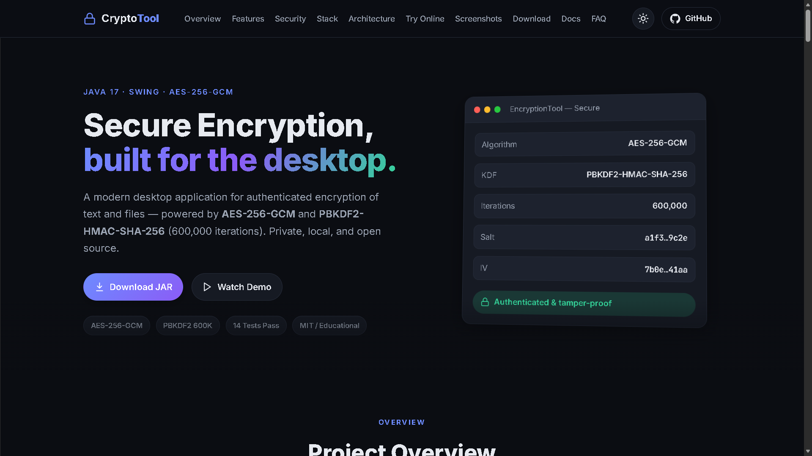
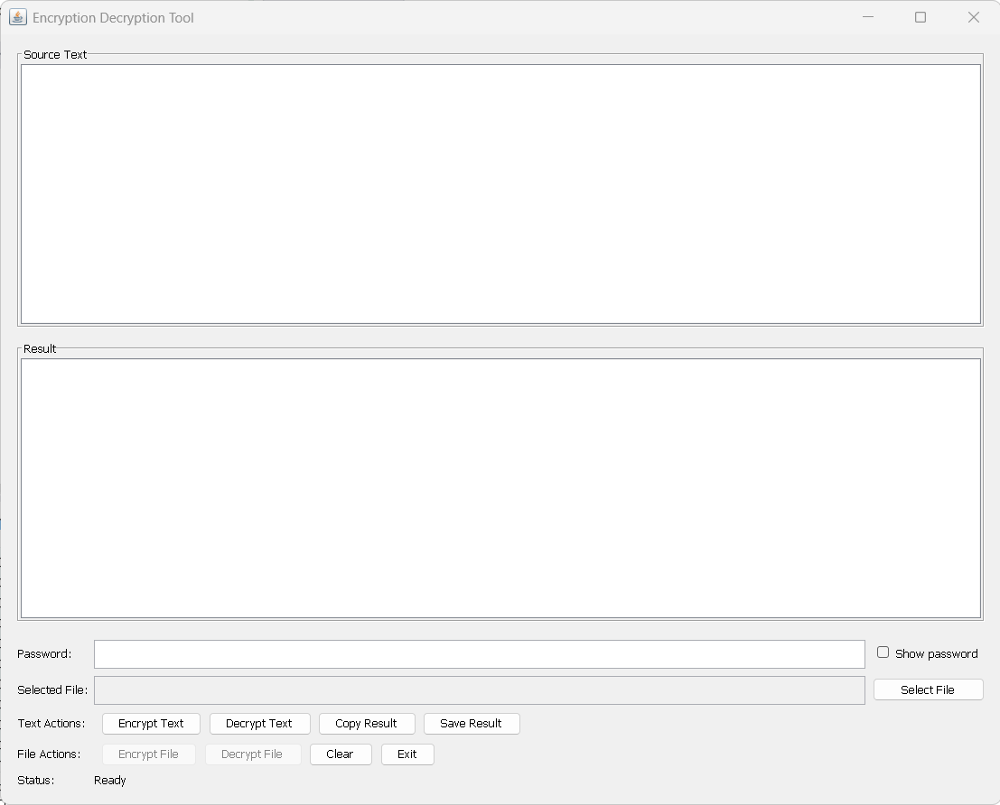
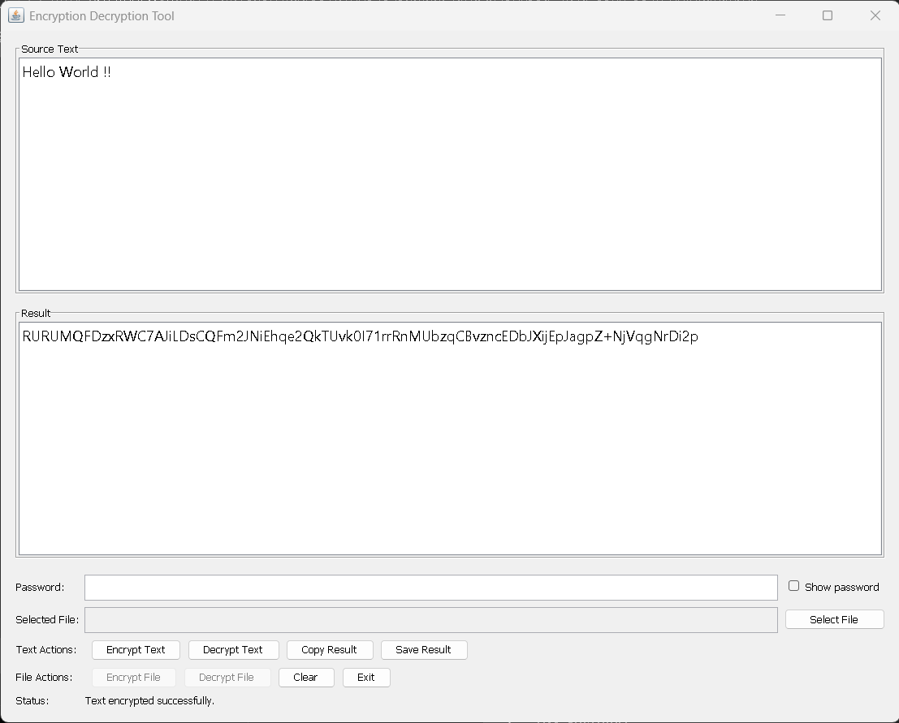
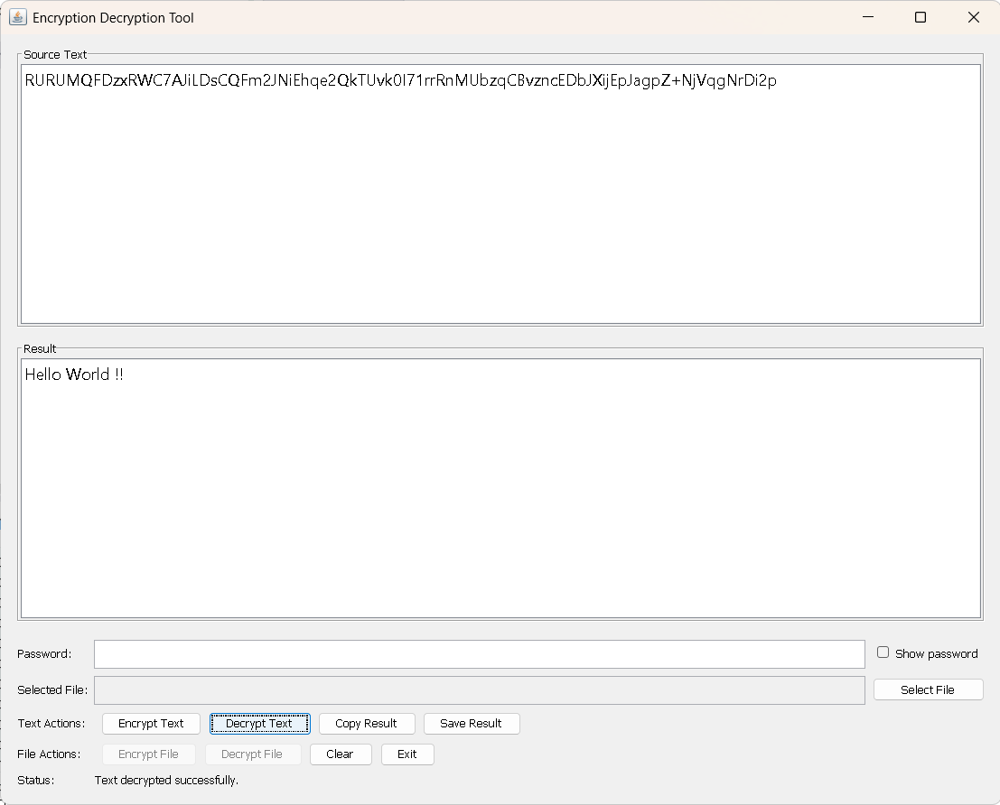
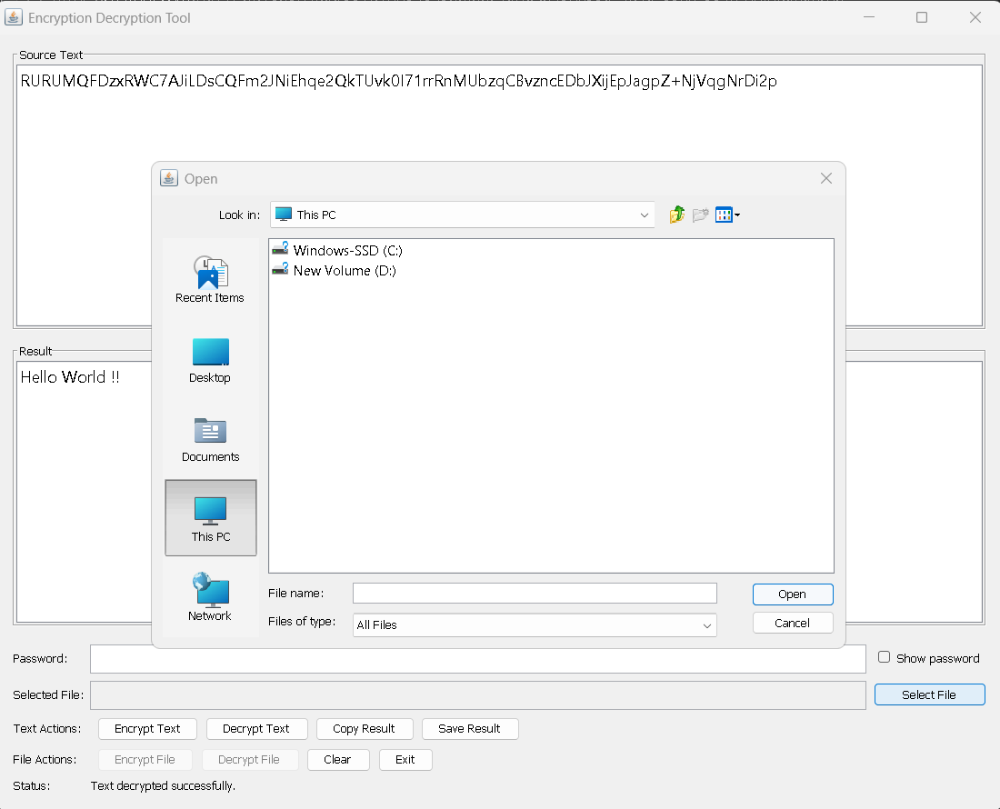
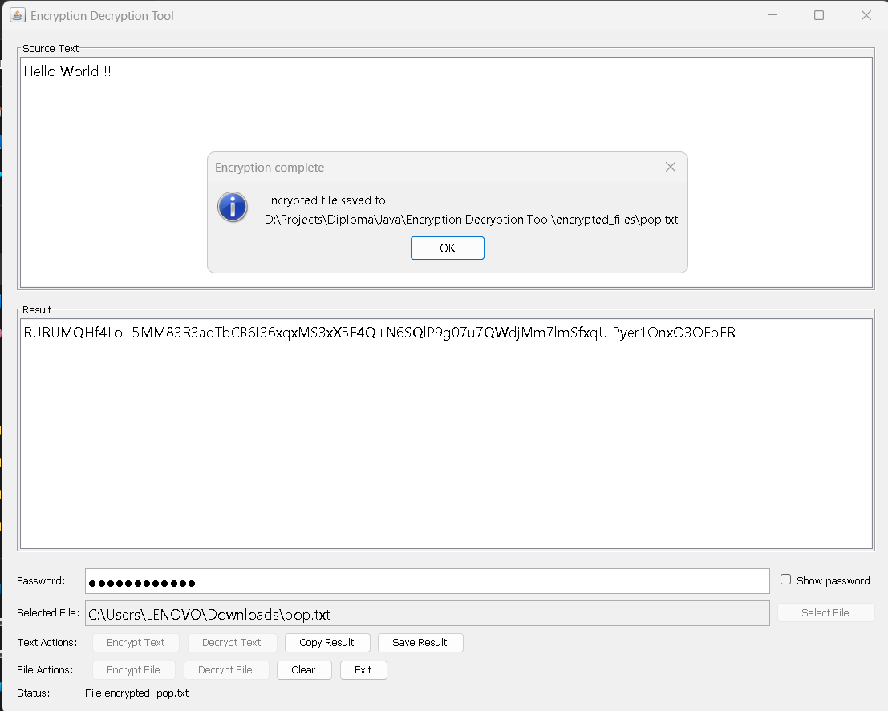
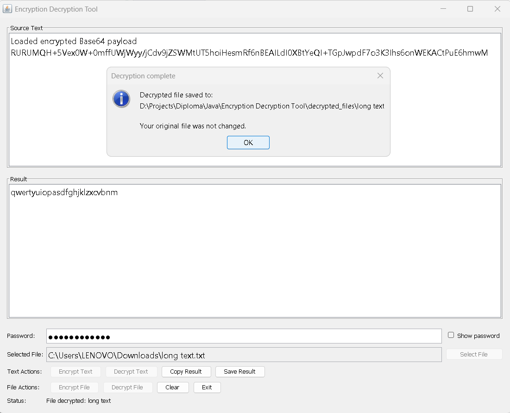
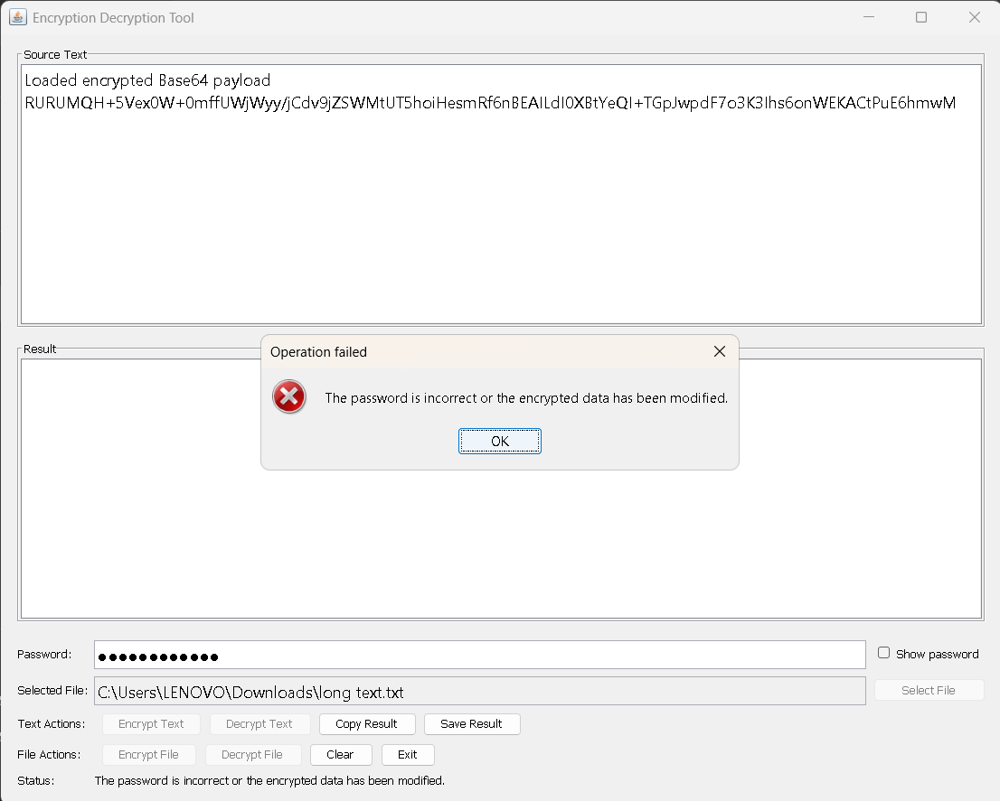

<div align="center">

# 🔐 Encryption Decryption Tool (Java GUI)

### Secure AES-256-GCM Text & File Encryption Desktop App

[](https://openjdk.org)
[](https://maven.apache.org)
[]()
[]()
[]()
[](https://opensource.org/licenses/MIT)
[](https://girishshenoy16.github.io/encryption-decryption-tool-java-gui/)


**A desktop application for secure, authenticated encryption and decryption of text and files, built with Java 17, Swing, and Maven — using AES-256-GCM with PBKDF2-HMAC-SHA-256 key derivation.**

[Live Website](https://girishshenoy16.github.io/encryption-decryption-tool-java-gui/) • [Key Features](#-key-features) • [Tech Stack](#-tech-stack) • [Architecture](#-architecture) • [Security Model](#-security-model) • [Screenshots](#-screenshots) • [Getting Started](#-getting-started)

</div>

---

<div align="center">

**[Live Website](https://girishshenoy16.github.io/encryption-decryption-tool-java-gui/)**




---

### 🎬 Demo Video

https://github.com/user-attachments/assets/974185d9-b3f6-453e-a225-608ce2b0ec57

*Click play to watch the demo*

</div>

---

## 📋 Table of Contents

- [Key Features](#-key-features)
- [Tech Stack](#-tech-stack)
- [Architecture](#-architecture)
- [Security Model](#-security-model)
- [Project Structure](#-project-structure)
- [Getting Started](#-getting-started)
- [Usage](#-usage)
- [How It Works](#-how-it-works)
- [Testing](#-testing)
- [Website (GitHub Pages)](#-website-github-pages)
- [Screenshots](#-screenshots)
- [Limitations](#-limitations)
- [Future Improvements](#-future-improvements)
- [License](#-license)

---

## ✨ Key Features

### 🔐 Authenticated Encryption
- **AES-256-GCM** for confidentiality **and** integrity (tampering and wrong passwords are detected)
- **PBKDF2-HMAC-SHA-256**, 600,000 iterations, 256-bit key derived from your password
- **Fresh random salt (16 bytes) + IV (12 bytes)** on every encryption

### 📝 Text & File Workflows
- **Text encryption / decryption** — paste text, get Base64 output (and vice versa)
- **File encryption / decryption** — encrypted output saved as readable Base64 `.txt`
- **Smart file detection** — a `.txt` with encrypted text enables *Decrypt File*; plain text enables *Encrypt File*
- **Result always shown** — the Result area displays the encrypted Base64 (encrypt) or restored plaintext (decrypt)

### 🖥️ Responsive, Safe GUI
- **Swing desktop UI** centered on launch, with source/result areas, password field (show/hide), and status bar
- **SwingWorker** background file operations — UI never freezes
- **Unicode / Devanagari support** — Nirmala UI font renders Hindi and other Indic scripts correctly
- **Safe by design** — passwords kept as `char[]` and wiped from memory after each operation; nothing sensitive is logged

---

## 🛠 Tech Stack

| Layer           | Technology                    | Purpose                                    |
|-----------------|-------------------------------|--------------------------------------------|
| **Language**    | Java 17                       | Core development                           |
| **Build**       | Maven 3.9+                    | Dependency management, packaging           |
| **GUI**         | Swing                         | Modern desktop interface                   |
| **Crypto**      | javax.crypto + java.security  | AES-256-GCM, PBKDF2-HMAC-SHA-256           |
| **Concurrency** | SwingWorker                   | Non-blocking background file operations    |
| **Testing**     | JUnit Jupiter 5.11            | Unit testing                               |

---

## 🏗 Architecture

```
┌───────────────────────────────────────────────────────────────────────┐
│                         SWING GUI (EncryptionFrame)                   │
│                                                                       │
│   ┌──────────────┐  ┌──────────────┐  ┌────────────────────────────┐  │
│   │  Source/     │  │  Password    │  │   SwingWorker (background) │  │
│   │  Result Area │  │  Field       │  │   encrypt/decrypt on EDT   │  │
│   └──────┬───────┘  └──────┬───────┘  └──────────────┬─────────────┘  │
└──────────┼─────────────────┼─────────────────────────┼────────────────┘
           │                 │                         │
┌──────────▼─────────────────▼─────────────────────────▼───────────────────┐
│                           APPLICATION LOGIC                              │
│                                                                          │
│   ┌───────────────────┐  ┌────────────────────────────────────────────┐  │
│   │   CryptoUtils     │  │        FileEncryptionService               │  │
│   │  (AES-256-GCM +   │  │  encryptFile / decryptFile                 │  │
│   │   PBKDF2, Base64) │  │  temp file + atomic move + overwrite prompt│  │
│   └───────────────────┘  └────────────────────────────────────────────┘  │
│   ┌───────────────────┐                                                  │
│   │   InputValidator  │  validates text, password, files, safe names     │
│   └───────────────────┘                                                  │
└──────────────────────────────────────────────────────────────────────────┘
```

---

## 🔐 Security Model

All encryption uses **AES-256-GCM** authenticated encryption. The server-less desktop tool derives
keys from a password via **PBKDF2-HMAC-SHA-256**, so a wrong password or corrupted data fails
verification and **never returns plaintext**.

```
   USER                                         APPLICATION
     │                                                │
     │  1. Enter plaintext + password                │
     │───────────────────────────────────────────────>│
     │                                                │  2. Derive key (PBKDF2, random salt)
     │                                                │  3. AES-GCM encrypt with random IV
     │                                                │  4. Build payload EDT1|ver|salt|iv|ct
     │<──────────── Base64 result in Result ──────────│
```

### Payload Format

```
EDT1 | version(1) | salt(16) | iv(12) | ciphertext + 128-bit GCM tag
```

| Property                | Value                                                     |
|-------------------------|-----------------------------------------------------------|
| Cipher                  | AES‑256‑GCM (authenticated)                               |
| Key derivation          | PBKDF2‑HMAC‑SHA‑256, **600,000** iterations               |
| Key size                | 256 bits                                                  |
| Salt                    | 16 bytes, cryptographically random, unique per encryption |
| IV / Nonce              | 12 bytes, cryptographically random, unique per encryption |
| Minimum password length | 12 characters                                             |

Text output is Base64 of that binary payload; file output is Base64 text in a `.txt`.

---

## 📁 Project Structure

```
Encryption Decryption Tool/
│
├── src/
│   ├── main/java/com/encryptiontool/
│   │   ├── main/
│   │   │   └── Main.java               # Entry point (EDT launch, system Look & Feel)
│   │   ├── gui/
│   │   │   └── EncryptionFrame.java    # Swing window; wires controls; runs SwingWorker
│   │   ├── crypto/
│   │   │   └── CryptoUtils.java        # AES-256-GCM + PBKDF2; text and byte APIs
│   │   ├── service/
│   │   │   └── FileEncryptionService.java # streamed file I/O, overwrite prompt, temp files
│   │   ├── utility/
│   │   │   └── InputValidator.java     # validates text, passwords, files, safe names
│   │   └── exception/
│   │       ├── CryptoException.java
│   │       ├── AuthenticationFailureException.java
│   │       ├── InvalidPayloadException.java
│   │       ├── ValidationException.java
│   │       └── FileOperationCancelledException.java
│   │
│   └── test/java/
│       ├── crypto/CryptoUtilsTest.java
│       └── service/FileEncryptionServiceTest.java
│
├── encrypted_files/                    # encrypted output (Base64 .txt)
├── decrypted_files/                     # restored output
├── outputs/                             # misc output
├── sample_files/                        # harmless demo text
├── screenshots/                         # README + website images
├── docs/                                # GitHub Pages website (frontend)
│   ├── index.html                       # Frontend site (all sections)
│   ├── assets/css/styles.css            # Site styling
│   ├── assets/js/main.js                # Site interactions
│   └── .nojekyll                        # Disable Jekyll
├── reports/                             # Detailed documentation
│   ├── executive-summary.md             # High-level project summary
│   └── project-report.md                # Detailed technical report
├── pom.xml                              # Maven build config
├── .gitignore
└── README.md
```

---

## 🌐 Website (GitHub Pages)

A modern, responsive **frontend website** is included in the [`docs/`](docs/) directory and is deployable to **GitHub Pages**. It showcases the project with a hero, features, security details, architecture, workflow, screenshots gallery, demo video, download, documentation, FAQ, and a light/dark theme.

> The Java desktop application does **not** run on GitHub Pages. The site is informational — visitors view screenshots, watch the demo, read docs, and **download the JAR** to run locally. It also includes a **client-side "Try It Online" playground** (in-browser AES-256-GCM via the Web Crypto API) that runs entirely in the visitor's browser.

### Local preview

```powershell
# From the repository root, open the site directly in your browser
start docs\index.html        # Windows
# or
open docs/index.html         # macOS
```

| Website file              | Purpose                                            |
|---------------------------|----------------------------------------------------|
| `docs/index.html`         | All sections (hero, features, security, FAQ, etc.) |
| `docs/assets/css/styles.css` | Responsive styling, light/dark theme            |
| `docs/assets/js/main.js`  | Theme toggle, smooth scroll, reveal & lightbox     |
| `docs/.nojekyll`          | Disables Jekyll processing                         |
| `reports/executive-summary.md` | High-level project summary                   |
| `reports/project-report.md`   | Detailed technical report                     |

---

## 🚀 Getting Started

### Prerequisites

- **JDK 17** (or newer)
- **Maven 3.9+** (only to build from source)
- No internet required — everything runs locally

### Installation

```powershell
# 1. Clone the repository
git clone https://github.com/girishshenoy16/encryption-decryption-tool-java-gui.git
cd "Encryption Decryption Tool"

# 2. Build the project
mvn clean package

# 3. Run the application
java -jar target/encryption-decryption-tool-1.0.0.jar
```

---

## 🎮 Usage

### Text Workflow
1. Enter text in **Source Text**.
2. Type a password (≥ 12 characters) in **Password**; tick **Show password** to reveal it.
3. Click **Encrypt Text** or **Decrypt Text**.
4. The result appears in the read‑only **Result** area.
   - **Copy Result** → system clipboard.
   - **Save Result** → saves as a `.txt` file (extension added automatically).
   - **Clear** → resets text, file, and password fields.

### File Workflow
1. Click **Select File**.
   - A `.txt` containing encrypted text → **Decrypt File** is enabled.
   - Plain text → **Encrypt File** is enabled.
   - `.edt` binary encrypted file → **Decrypt File** is enabled.
2. Enter the password and click **Encrypt File** / **Decrypt File**.
3. Encrypted files are written to `encrypted_files/` as Base64 `.txt`
   (the original extension is replaced, e.g. `data.txt` → `encrypted_files/data.txt`).
   Decrypted files are written to `decrypted_files/`.
4. The **Result** area shows the output — encrypted Base64 (encrypt) or restored plaintext (decrypt).
   Your original file is **never modified**.

> If an output file already exists you are asked to confirm overwriting.

---

## 🔄 How It Works

### Text Encryption Flow

```
1. User enters plaintext + password in the GUI
2. CryptoUtils derives a 256-bit key with PBKDF2 (random 16-byte salt, 600k iterations)
3. AES-256-GCM encrypts with a random 12-byte IV
4. Payload EDT1|ver|salt|iv|ciphertext+tag is Base64-encoded into the Result area
```

### File Decryption Flow

```
1. User selects a .txt (Base64) or .edt encrypted file
2. FileEncryptionService reads the payload and derives the key using the stored salt
3. AES-256-GCM decrypts and verifies the authentication tag
4. Wrong password / tampered data → AuthenticationFailureException (no plaintext)
5. Decrypted bytes are written via temp file + atomic move into decrypted_files/
```

### Password Safety

```
char[] password = passwordField.getPassword();   // not String
try { ... crypto ... } finally { Arrays.fill(password, '\0'); }  // wiped after use
```

---

## 🧪 Testing

### Run Tests

```powershell
mvn test
```

### Test Coverage

| Module                  | Test File                        | What's Tested                                        |
|-------------------------|----------------------------------|------------------------------------------------------|
| `CryptoUtils`           | `CryptoUtilsTest.java`           | Round-trip, Unicode, long text, wrong password,      |
|                         |                                  | tampered payload, invalid Base64, fresh salt/IV      |
| `FileEncryptionService` | `FileEncryptionServiceTest.java` | Byte-identical round-trip, missing/directory reject, |
|                         |                                  | corrupt-file reject, overwrite approve/reject,       |
|                         |                                  | no partial output after failure                      |

---

## 📸 Screenshots

<table>
  <tr>
    <td align="center"><b>Application Launch</b></td>
    <td align="center"><b>Text Encrypted</b></td>
    <td align="center"><b>Text Decrypted</b></td>
  </tr>
  <tr>
    <td></td>
    <td></td>
    <td></td>
  </tr>
  <tr>
    <td align="center"><b>File Chooser</b></td>
    <td align="center"><b>Encrypted File</b></td>
    <td align="center"><b>Decrypted File</b></td>
  </tr>
  <tr>
    <td></td>
    <td></td>
    <td></td>
  </tr>
  <tr>
    <td align="center" colspan="3"><b>Wrong Password Error</b></td>
  </tr>
  <tr>
    <td align="center" colspan="3"></td>
  </tr>
</table>

---

## ⚠️ Limitations

### Security Limitations

- **No password recovery** — encryption is keyed solely from your password. If you forget it, your data is permanently unrecoverable. This is by design (no backdoors), but it means you must remember your password.
- **No key file support** — the tool only supports password-based key derivation. There is no option to use a hardware token, smart card, or key file for additional security.
- **No key rotation** — once encrypted, there is no built-in way to change the password on an encrypted file without first decrypting and re-encrypting.
- **No digital signatures** — the tool provides confidentiality and integrity (via GCM authentication), but not non-repudiation. It cannot prove who encrypted the data.
- **PBKDF2 iteration count is fixed** — the 600,000 iteration count is hardcoded. It cannot be adjusted for faster hardware or compliance requirements.

### Functional Limitations

- **Single-user, local-only** — no multi-user support, no network features, no cloud integration. Everything runs on your local machine.
- **Manual password entry** — passwords must be typed manually each time. There is no clipboard integration, password manager support, or biometric authentication.
- **One file at a time** — batch encryption of multiple files is not supported. Each file must be selected and processed individually.
- **No progress indicator** — large file operations run in the background via `SwingWorker`, but there is no visual progress bar or percentage indicator.
- **Limited file format support** — only `.edt` (binary) and `.txt` (Base64) encrypted formats are recognized. Other encrypted file types are not handled.

### Technical Limitations

- **Base64 overhead** — encrypted `.txt` files are approximately 33% larger than the original due to Base64 encoding.
- **Java 17 required** — the application requires JDK 17 or newer. It is not backward-compatible with older Java versions.
- **Swing UI** — the interface uses Java Swing, which may not match the native look and feel of your operating system.
- **No command-line interface** — there is no CLI mode. The tool can only be used through the graphical interface.
- **File size limited by memory** — files are read entirely into memory for encryption/decryption. Very large files (multi-GB) may cause `OutOfMemoryError`.

### Use-Case Limitations

- **Educational / defensive use only** — this tool is not a substitute for audited, production-grade encryption libraries. For sensitive data, use vetted tools like GPG, age, or platform-native encryption.
- **No compliance certification** — the cryptographic implementation has not been formally audited or certified (e.g., FIPS 140-2). It should not be used in regulated environments.

---

## 🔮 Future Improvements

| Enhancement                | Description                                       | Difficulty |
|----------------------------|---------------------------------------------------|------------|
| **Key file support**       | Derive key from a key file instead of a password  | Medium     |
| **Drag & drop**            | Drop files to encrypt/decrypt                     | Easy       |
| **Progress bar**           | Visual progress for large file operations         | Easy       |
| **Theme toggle**           | Light/dark Look & Feel switch                     | Easy       |
| **Clipboard history**      | Secure ephemeral history of results               | Medium     |
| **Batch mode**             | Encrypt/decrypt multiple files at once            | Medium     |

---

## 📄 License

This project is licensed under the **MIT License** — see the [LICENSE](LICENSE) file for details.

You are free to use, modify, and distribute this software for any purpose, including commercial use, provided the copyright notice and permission notice are included.

---

<div align="center">

**Built with Java 17, Swing, and AES-256-GCM + PBKDF2 Authenticated Encryption**

[⬆ Back to Top](#-encryption-decryption-tool-java-gui)

</div>
