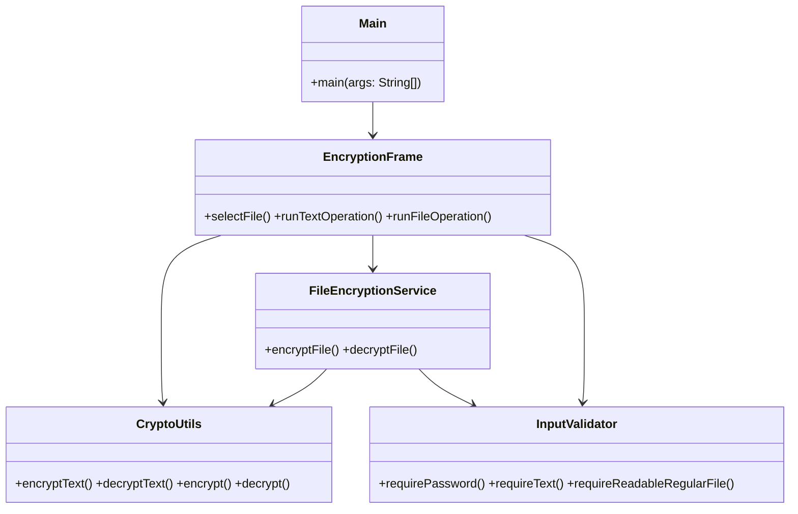
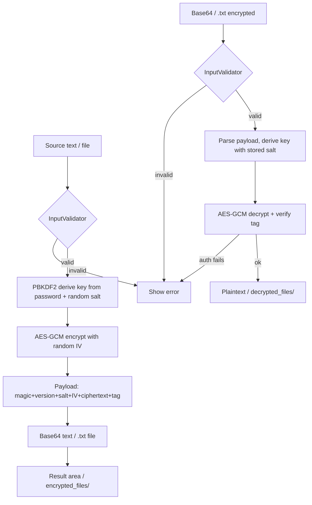
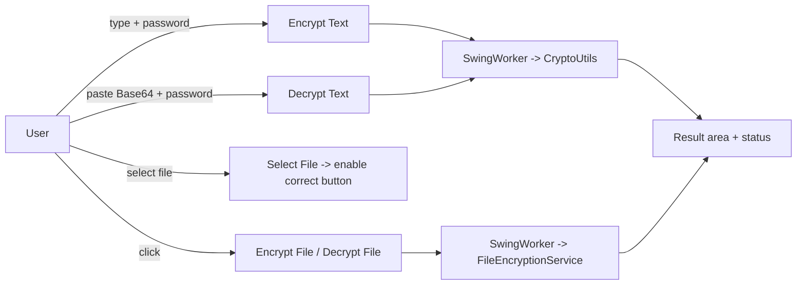

# Project Report — Encryption Decryption Tool

## 1. Problem Statement

People routinely store sensitive text and files on their own machines in plain form. This
project is an educational desktop application that lets a user **encrypt** that data with a
password and **decrypt** it later, using strong, modern, authenticated cryptography. It is
built to demonstrate correct cryptographic practice (no homemade algorithms, no stored
passwords, authenticated encryption) in a simple Swing interface.

## 2. Simple Explanation (for a non-technical reader)

Imagine you have a secret note. You put it in a special box that can only be opened with a
password you choose. Our program builds that box:

- You type your text (or pick a file) and a password.
- The program scrambles the data into gibberish that cannot be read without the password.
- To read it again, you supply the same password; the program unscrambles it.
- If someone changes even one character of the scrambled data, or guesses the wrong password,
  the program refuses to open it — it never shows fake/partial content.

The scrambled result is saved as an ordinary `.txt` file containing Base64 text, so you can
even copy it and paste it back later.

## 3. Technical Explanation

### 3.1 Encryption approach

| Aspect                      | Choice                                                   |
|-----------------------------|----------------------------------------------------------|
| Confidentiality + integrity | **AES-256-GCM** (Galois/Counter Mode)                    |
| Key derivation              | **PBKDF2-HMAC-SHA-256**, 600,000 iterations, 256-bit key |
| Salt                        | 16 random bytes, unique per encryption                   |
| Nonce / IV                  | 12 random bytes, unique per encryption                   |
| Minimum password            | 12 characters                                            |
| Output (text)               | Base64 of the binary payload                             |
| Output (file)               | Base64 text `.txt`                                       |

GCM is an **authenticated** mode: it produces a tag that verifies the ciphertext has not been
tampered with and that the correct key was used. A wrong password or corrupted data fails
authentication and throws, so plaintext is **never** returned.

### 3.2 Payload format

```
EDT1 | version(1) | salt(16) | iv(12) | ciphertext + 128-bit GCM tag
```

`EDT1` is a 4-byte magic header used to recognize our payloads.

### 3.3 Java & security concepts demonstrated

- `javax.crypto.Cipher` with `AES/GCM/NoPadding`
- `SecretKeyFactory` + `PBEKeySpec` for PBKDF2 key derivation
- `SecureRandom` for salt/IV generation
- `SwingWorker` for non-blocking background file work (UI stays responsive)
- Event Dispatch Thread (EDT) correctness
- `char[]` passwords wiped with `Arrays.fill(.., '\0')` after use; no secrets logged

## 4. Architecture

### 4.1 Packages

```
main.Main            -> entry point; applies system Look & Feel; starts GUI on the EDT
gui.EncryptionFrame  -> Swing window; wires controls to crypto/service; runs SwingWorker
crypto.CryptoUtils   -> AES-256-GCM + PBKDF2; text and byte APIs; payload parsing
service.FileEncryptionService -> encrypted/decrypted file I/O, overwrite prompts, temp files
utility.InputValidator -> validates text, passwords, files, safe names
exception.*          -> typed errors: CryptoException, AuthenticationFailureException,
                       InvalidPayloadException, ValidationException, FileOperationCancelledException
```

### 4.2 Class responsibilities (Mermaid)



### 4.3 Encryption / decryption flow (Mermaid)



### 4.4 GUI event flow (Mermaid)



## 5. Implementation Phases

1. **Project setup** — Maven (Java 17), packages, safe output directories, runnable JAR, EDT launcher.
2. **Crypto foundation** — `CryptoUtils` with versioned AES-GCM payload, PBKDF2, Base64, typed exceptions.
3. **Validation & file services** — `InputValidator` and `FileEncryptionService` (temp files, overwrite prompt, cleanup on failure).
4. **GUI layout** — `EncryptionFrame` with source/result areas, password field, controls, status.
5. **GUI integration** — wired actions to crypto/service, `SwingWorker`, dialogs, secure password wiping.
6. **Quality assurance** — full Maven test suite, manual simulations, packaging verification.
7. **Documentation** — README and this report.
8. **GitHub readiness** — repository `encryption-decryption-tool-java-gui`, topics, milestone commits.

## 6. Virtual Simulation (safe, no real secrets)

Sample values used only for demonstration:

- Plaintext: `Confidential project note: Cafe ₹100 — surakshit`
- Password: `DemoPassword#2026` (>= 12 chars)
- File: `sample_files/demo-note.txt`

Expected results:

| Step                          | Observation                                                                                |
|-------------------------------|--------------------------------------------------------------------------------------------|
| Encrypt text                  | Base64 string begins with `RERUMQ...` (decoded `EDT1`), different each run (fresh salt/IV) |
| Decrypt with correct password | Original plaintext restored exactly                                                        |
| Decrypt with wrong password   | Authentication failure, no plaintext shown                                                 |
| Tamper one byte of ciphertext | Authentication failure                                                                     |
| Encrypt `demo-note.txt`       | `encrypted_files/demo-note.txt` (Base64)                                                   |
| Decrypt it                    | Byte-identical restore in `decrypted_files/`                                               |
| Hindi / Unicode text          | Displays and round-trips correctly (Nirmala UI font)                                       |

## 7. Testing

```bash
mvn test
```

Coverage:
- Text round-trip, Unicode/special characters, long text
- Wrong password -> authentication failure (no plaintext)
- Tampered payload -> rejected
- Invalid Base64 / malformed payload -> rejected
- Fresh salt + IV on every encryption
- File round-trip byte equality, missing/directory rejection, corrupt-file rejection,
  overwrite approve/reject, no partial output after failure

## 8. Security Considerations

- All cryptographic operations use standard Java security APIs (`javax.crypto`, `java.security`)
- No custom or home-grown algorithms
- Passwords are handled as `char[]` and wiped from memory after use
- Salt and IV are generated fresh for every encryption operation
- Encrypted files are written via temp file + atomic move to prevent partial writes
- GCM authentication tag detects tampering and wrong passwords

## 9. Limitations

- No password recovery mechanism (by design)
- Single-user, local-only operation
- No batch file processing
- Educational/defensive use only — not audited for production
- Java 17+ required
- Memory-limited file size handling
- No key rotation or re-encryption support
- No digital signatures (confidentiality + integrity only)

## 10. Learning Outcomes

- Correct use of Java cryptography APIs (`Cipher`, `SecretKeyFactory`, `PBEKeySpec`)
- Authenticated encryption and why it matters
- Secure password handling and secure file output (temp file + atomic move)
- Responsive Swing design with `SwingWorker` and EDT discipline
- Maven build/test/packaging and clean, documented project structure

## Repository

**GitHub:** `https://github.com/girishshenoy16/encryption-decryption-tool-java-gui`

**Live Website:** `https://girishshenoy16.github.io/encryption-decryption-tool-java-gui/`
